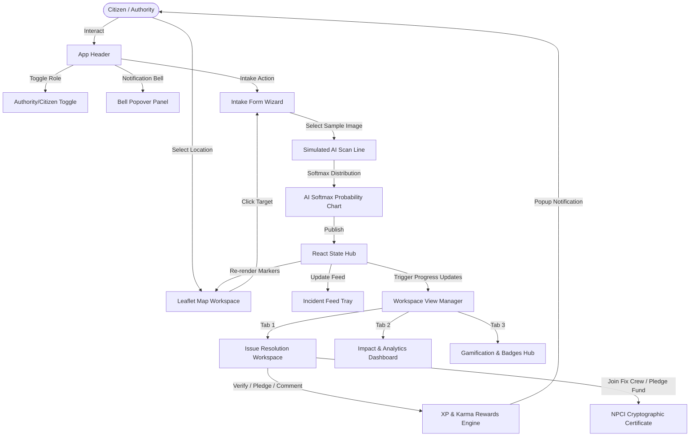

# 🇮🇳 NagrikHero: Smart City Civic Resolution Platform

**NagrikHero** (formerly Community Hero) is a map-centric, gamified civic problem solver web application built for next-generation smart cities in India. It empowers citizens to report local infrastructure anomalies, organize community cleanups, crowdfund neighborhood repairs, and track official municipal resolutions in real-time.

Built using a **dark cyber-glassmorphism aesthetic**, NagrikHero simulates integration with India's Digital Public Infrastructure (DPI) and smart city platforms, utilizing client-side encryption and localized municipal databases.

---

## 🚀 Key Features

*   **Interactive Geographic Map**: Features custom vector and satellite map layers showing color-coded incident markers based on severity (Critical, Major, Minor) and status (Reported, Verified, In Progress, Resolved).
*   **AI-Assisted Multi-Step Intake Form**: Simulates neural convolutional network scans on uploaded photos to auto-tag reports, predict severity, output a Softmax probability distribution chart, and lock GPS coordinates.
*   **Header Notification Center**: Interactive bell widget showing unread notifications of civic milestones. Clicks route the user directly to the target incident on the map.
*   **NPCI-DPI Cryptographic Credentials**: Succeeding in a micro-pledge or volunteering triggers an official Swachh Bharat Smart City Contribution Certificate featuring municipal seals, signatures, and transaction verification hashes (`SHA-256`).
*   **Gamified Rewards & Quests (Hero Hub)**: Track citizen XP level, active neighborhood quests, earn badges (e.g. *Pothole Patrol*, *Eco-Warrior*), and compete on community leaderboards.
*   **AI Chatbot with Voice Control (HeroBot)**: Features speech-to-text voice input controls and text-to-speech audio feedback.
*   **Civil Authority Console**: Secure portal (`admin@cityhall.gov` / `admin2026`) letting inspectors assign tasks, dispatch repair crews, update status history timelines, and push tickets to Swachh Bharat grievance gateways.

---

## 🛠️ Technology Stack

| Component | Technology | Description |
| :--- | :--- | :--- |
| **Core Framework** | React 18, Vite | For fast, component-driven client builds. |
| **Map Engine** | Leaflet.js, CartoDB | Interactive geospatial rendering of incident pins. |
| **Icons** | Lucide React | Clean, responsive vector icons. |
| **Styling** | Vanilla CSS, HSL Variables | Cyberpunk dark theme with glassmorphism overlays. |
| **Sound Synthesis**| Web Audio API | Synthesized UI click alerts, XP chimes, and chords. |
| **Voice Assist** | Web Speech API | Native Speech-to-Text & Text-to-Speech parser. |
| **Database Engine**| LocalStorage + XOR Shift | client-side data syncing with salt-hex ciphers. |

---

## 📐 System Architecture



---

## 🏛️ Local Municipal Agency Routing

For each Indian city and category of incident, NagrikHero automatically routes tickets to the official government division:

*   **Mumbai**: Brihanmumbai Municipal Corporation (BMC) Road/Hydraulics/SWM Dept & BEST.
*   **Bengaluru**: Bruhat Bengaluru Mahanagara Palike (BBMP) & BWSSB/BESCOM.
*   **New Delhi**: New Delhi Municipal Council (NDMC), Municipal Corporation of Delhi (MCD), & Delhi Jal Board.
*   **Pune**: Pune Municipal Corporation (PMC) & Mahadiscom (MSEDCL).

---

## 🔑 Cryptographic Security Engine

All client-side states are stored inside standard localStorage using a custom cipher wrapper (`src/data/dbEngine.js`).
1. Decrypted JSON data objects are encrypted via a 256-bit salt shift.
2. Encrypted string is translated to hex block cipher text (`ch_db_issues`).
3. Authority Console lists the live decryption latency (`~0.2 ms`) and raw cipher hex output for verification.

---

## 💻 Local Installation & Setup

Ensure you have [Node.js](https://nodejs.org/) installed, then execute:

```powershell
# 1. Clone or copy files to folder, navigate to root
cd Vibe2Ship

# 2. Install dependencies
npm install

# 3. Start local development server
npm run dev
```

Open the development URL (usually `http://localhost:5173`) in your browser to test the platform.

### 🧪 How to run Production Build

```powershell
# Build static production assets
npm run build

# Preview the minified production build locally
npm run preview
```
